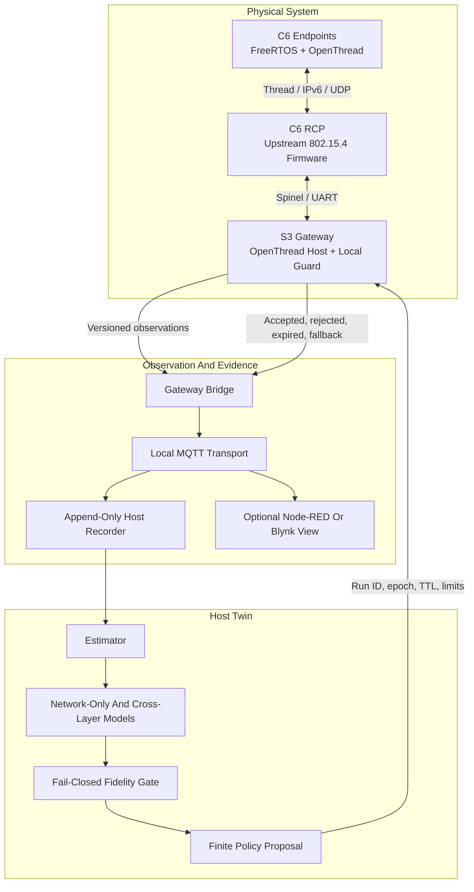
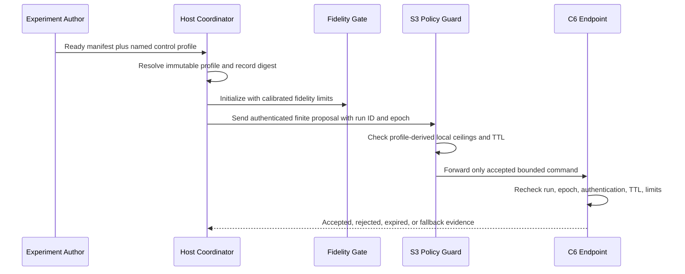

# SYSTEM DESIGN

## Design Intent And Boundaries

This design describes a small hardware-in-the-loop system for examining deadline-aware IoT traffic on a physical Thread mesh. It deliberately connects four layers that are often evaluated in isolation: endpoint scheduling, bounded queues, wireless delivery, host-side prediction, and safety-limited feedback. The goal is not to optimize a consumer device or emulate a cellular network. The goal is to create a transparent experiment in which an observed physical system can be modeled, challenged, and—only after validation—adjusted through one narrow control surface.

The first useful outcome is a measured Thread testbed. The second is a digital shadow, where physical observations update a host model but do not modify the system. The final intended outcome is a closed-loop digital twin, where a validated model proposes a bounded policy, the physical system independently validates it, and the later physical outcome returns to the model. These labels are earned by behavior, not by the presence of a dashboard.

| Achieved Behavior | Honest Label |
|---|---|
| Recorded traces are loaded manually into an offline model | Offline model or simulator |
| Physical observations automatically update a host model | Digital shadow |
| Physical observations, model output, bounded actuation, and returned outcomes form one verified loop | Digital twin |
| Real radios and firmware are in the timed experiment | Hardware-in-the-loop testbed |
| Actual waveform/channel processing passes through a channel emulator | Radio/PHY-in-the-loop; out of scope |

The system changes only devices and networks owned by the experimenter. It does not jam a radio channel, interfere with a public network, exploit a vulnerability, or treat an upstream networking stack as project-owned code. Impairments are intentionally limited to application workload timing, queue pressure, deliberate observation pause, restart, and documented physical placement change.

## Architectural Principle

The design isolates **observation**, **modeling**, and **actuation**. A dashboard must never become a hidden controller, and a host-side decision must never be the only safety check before a physical device changes behavior.

The laptop is the **experiment authority**. It owns immutable manifests, raw evidence, model fitting, held-out scoring, and reporting. The ESP32-S3 is the **edge safety authority**. It owns the active local policy, acceptance checks, fallback decision, and propagation of a valid command to endpoints. The endpoints are **local enforcement authorities**. They must refuse a command that has wrong run identity, stale epoch, invalid authentication, expired TTL, or values outside compiled limits even if the S3 previously accepted it.

This hierarchy prevents a common failure mode in IoT demonstrations: treating successful message delivery as proof that a policy was safe. A message can arrive correctly while being stale, based on an invalid model, intended for a previous run, or beyond an endpoint’s safe operating limit.

## Hardware And Upstream Boundaries

The physical plan uses an ESP32-S3 as the gateway, one ESP32-C6 as a dedicated Radio Co-Processor, and two ESP32-C6 endpoints. The separation is intentional. ESP-IDF documents UART and SPI RCP radio modes for an external IEEE 802.15.4 co-processor, and the Thread examples include both a border router and an RCP application. The first implementation uses UART because it is easier to inspect and recover during bring-up; SPI is not added unless recorded evidence shows that UART itself limits the experiment. [ESP-IDF Thread Guide](https://docs.espressif.com/projects/esp-idf/en/latest/esp32s3/api-reference/network/esp_openthread.html)

The RCP runs upstream firmware and contains no project workload logic. The S3 hosts the Thread-side gateway logic and Wi-Fi backhaul. Endpoint firmware contains the project’s workload release, deadline queue, timestamping, local accounting, policy enforcement, and optional comparative power probe. Every physical run must record the exact ESP-IDF revision, upstream example/version, `sdkconfig`, target, binary digest, board label, and transport configuration. The CMake files in this repository declare intended dependencies; they do not prove that any dependency has already been configured or flashed.

The gateway uses ESP-IDF FreeRTOS. ESP-IDF’s FreeRTOS implementation is SMP-aware on the ESP32-S3 and supports a single-core build through `CONFIG_FREERTOS_UNICORE`; task affinity can be expressed through the `...PinnedToCore()` APIs. This makes a paired scheduler experiment possible, but not automatically meaningful. Internal platform tasks, network traffic, and interrupt load must be traced before task placement is interpreted. [ESP-IDF FreeRTOS SMP Guide](https://docs.espressif.com/projects/esp-idf/en/latest/esp32s3/api-reference/system/freertos_idf.html)

## Ownership By Module

The source tree is arranged around ownership rather than around a user interface. The present files establish interfaces and implementation checklists; none should be described as complete runtime code.

| Location | Owner And Responsibility | Must Not Own |
|---|---|---|
| `common/include/cldt/` | Stable platform-neutral contracts for status, types, protocol framing (`cldt_protocol.h`), ChaCha20-Poly1305 auth (`cldt_auth.h`), CRC-32C (`cldt_crc32c.h`), clock sync, trace, metrics, and control profiles | ESP-IDF handles, broker handles, filesystem paths, or dashboard state |
| `common/src/` | Deterministic, allocation-free implementations of those contracts | Radio I/O, task creation, or JSON parsing |
| `host/experiment_config.*` | Conversion of a schema-valid ready manifest into bounded runtime configuration | Acceptance of template manifests or secret storage |
| `host/run_recorder.*` | New append-only evidence directory and one terminal run status | Modification or deletion of prior run evidence |
| `host/kalman.*` | 5-state discrete-time linear Kalman filter state estimation with covariance uncertainty | Policy actuation or direct network I/O |
| `host/estimator.*` and `host/twin_model.*` | State estimation, shadow prediction, and scoring across 3 models | Sending a policy directly to a device |
| `host/fidelity_gate.*` | Fail-closed decision machine driven by model residuals and Kalman covariance | Policy serialization, network I/O, or edge enforcement |
| `host/policy.*` | Proposal generation and host-side static bounds | Applying a proposal to physical hardware |
| `host/analysis/reproduce.py` | Scaffold for the planned post-hoc reproduction pipeline (lifecycle audit, model scoring, confidence intervals) | Modifying raw traces or manifests |
| `firmware/gateway/main/` | RCP/Thread bridge, OpenThread MAC diagnostics (`thread_diagnostic.*`), local guard, backhaul, boot lifecycle, and gateway trace | Model fitting or hidden remote fallback dependency |
| `firmware/endpoint/main/` | Local workload, EDF deadline queue (`deadline_queue.*`), trace, time mapping, transport, and INA219 power probe (`power_probe.*`) | Authority to change global experiment parameters |

The source distinction is a practical safeguard. For example, the host model cannot secretly apply a policy because `cldt_twin_model_predict()` is side-effect free. Conversely, the gateway guard cannot make a favorable model decision because it receives only a proposal and locally validates it.

## Runtime Structure And Concurrency

The exact FreeRTOS task implementation is still skeletal. The following ownership plan is the design contract that implementation must preserve.

### Gateway Runtime

The gateway lifecycle in `gateway_runtime.h` is explicit: boot, provisioning, Thread formation, idle, warm-up, measurement, cooldown, fallback, and fault. The supervisor is the only task allowed to advance this lifecycle. It creates static queues and event groups before worker tasks run, starts work only after provisioning, RCP, Thread, and backhaul are ready, and requests bounded shutdown at an experiment boundary.

The Thread bridge accepts project datagrams from the Thread side and copies only validated work into `thread_rx_queue`. An OpenThread diagnostic adapter (`thread_diagnostic.h`) polls low-level MAC metrics directly from OpenThread's C API on the S3 host via Spinel:
- `otLinkGetCounters()`: extracts `mTxTotal`, `mTxRetry` (MAC retransmissions), `mTxErrCca` (Clear Channel Assessment failures), `mTxDirectMaxRetryExpiry` (max retry exhaustion), and `mRxErrFcs`.
- `otThreadGetParentInfo()`: extracts parent RLOC16, inbound link quality (`mLinkQualityIn`), and outbound link quality (`mLinkQualityOut`).
- `otThreadGetLeaderData()`: extracts partition ID (`mPartitionId`) to detect network partition splits and merges.
- `otThreadGetDeviceRole()`: detects dynamic Thread role transitions (router, child, leader).

The aggregator turns device trace records and MAC diagnostic deltas into gateway observations and places them into `observation_queue`. The publisher owns broker/backhaul I/O and drains that queue. The command consumer is the sole writer of the active policy snapshot. It calls `cldt_policy_guard_accept()` before changing state and emits an acknowledgement or rejection record after the critical section is released. The policy guard owns `active_policy` and `applied_epoch`; no other task may modify them.

For the SMP build, keep initial affinity minimal and measurable. A reasonable first hypothesis is that Thread/backhaul integration and radio-facing activity remain on one core while aggregation and publishing are pinned or observed on the other. It remains a hypothesis until trace evidence shows reduced queueing or deadline impact. The unicore comparison must use the same source and workload, differing only in the documented scheduler configuration and resulting gateway binary.

### Endpoint Runtime

The endpoint lifecycle is also explicit: boot, commissioning, attached, idle, running, fallback, and fault. A workload-release task creates logical work items with a `run_id`, `node_id`, `boot_id`, sequence number, traffic class, release time, and deadline. It never blocks on a network operation.

The endpoint implements an **Earliest Deadline First (EDF)** queue (`deadline_queue.h`):
- **Data structure:** Bounded fixed-pool array (no heap allocation) with an index array sorted by absolute `deadline_local_us`.
- **Insertion & Admission:** Binary search finds the exact position in the deadline order. If the pool is full, admission control compares the incoming deadline against the latest deadline in the queue; the item expiring latest is rejected or evicted, ensuring maximum deadline feasibility (Liu & Layland, 1973).
- **Periodic Expiry:** A dedicated 10 ms hardware-backed `esp_timer` executes an expiry sweep that purges work whose deadline has passed (`deadline_local_us <= now_local_us`) and compacts the ordering array before late work enters the radio buffer.
- **Capacity Reservation:** Slots are reserved for `CLDT_TRAFFIC_CONTROL` and `CLDT_TRAFFIC_CRITICAL` streams. For telemetry, older same-source items are coalesced.

The transmitter task pops the earliest-deadline slot from the EDF queue and passes it to the Thread transport adapter. The trace task drains local records into a bounded export path. When energy measurement is enabled, the INA219 power task (`power_probe.h`) samples voltage and current at 12-bit resolution (532 µs conversion) over I2C (`GPIO6`/`GPIO7`), integrating energy $\sum (V \cdot I \cdot \Delta t)$ to report energy per successfully delivered critical item (µJ/item).

### Synchronization Rules

The first implementation should follow four simple rules:

1. An ISR records a minimal event or wakes a task. It does not allocate memory, publish MQTT, parse a frame, update a model, or apply a policy.
2. A queue has one documented owner for enqueue policy and one documented consumer for terminal accounting. It does not become a shared unbounded buffer.
3. Any mutex or spinlock protects one short-lived data object. Do not hold a lock while waiting for a queue, broker, radio, filesystem, or timer.
4. A task that needs multiple resources takes them in one globally documented order. If that order cannot be upheld, redesign the handoff rather than adding a timeout and calling it deadlock prevention.

The code must record queue depth high-water marks, pool exhaustion, rejection, coalescing, expiry, drop, and duplication. A low average queue depth is not evidence of correct scheduling if one critical item was silently lost.

## Time, Identity, And Accounting

Every logical item is identified by the combination of `run_id`, `node_id`, `boot_id`, and sequence. The `run_id` ties an item to one frozen ready manifest. The `node_id` prevents two devices with coincidentally equal boot and sequence values from becoming one apparent item. The endpoint changes `boot_id` at restart so a reused sequence number cannot be mistaken for pre-restart work. A transport retry is trace detail, not another logical item.

Each `cldt_trace_record_t` carries a local monotonic event timestamp, the work item's original release and deadline in the same local clock domain, traffic class, node identity, boot identity, sequence, policy epoch, queue depth, core identifier where meaningful, RSSI where available, and time uncertainty. Non-work-item events store zero in the release and deadline fields. The in-memory type is deliberately not a packed wire structure. `cldt_protocol_encode()` and `cldt_protocol_decode()` must serialize fields by explicit offset and network byte order; casting a byte buffer to a C struct would make the protocol dependent on alignment, padding, and endianness.

`cldt_clock_sync_t` uses four timestamps and produces an offset, drift estimate, and uncertainty. It maps one monotonic clock domain into another; it must never alter a device clock. One-way delay is reportable only when the associated uncertainty is captured and within a predeclared bound. Round-trip time, queue delay, deadline outcome, and event order remain useful even when one-way timing is not justified.

Evidence reconciliation has two mandatory layers. `cldt_metrics_reconcile()` checks aggregate conservation per traffic class: released work must equal terminal outcomes plus explicitly unresolved work. `cldt_metrics_audit_sorted_trace()` separately groups raw records by full logical identity and rejects duplicate releases, duplicate terminal outcomes, terminals without releases, and unresolved items. Aggregate equality is necessary but not sufficient because a duplicate terminal for one item can numerically conceal a missing terminal for another. A service ratio may be computed only after both checks pass.

## Wire And Command Contract

The public wire contract is declared in `cldt_types.h` and `cldt_protocol.h`.

Version 1 uses a fixed 72-byte header. The offsets below are normative and are also declared as `CLDT_WIRE_*_OFFSET` constants; multi-byte integers use network byte order.

| Byte Range | Field |
|---|---|
| 0–1 | Magic |
| 2 | Protocol version |
| 3 | Frame kind |
| 4 | Traffic class |
| 5–6 | Flags |
| 7 | Hop limit |
| 8–11 | Node ID |
| 12–15 | Boot ID |
| 16–19 | Sequence |
| 20–23 | Policy epoch |
| 24–31 | Run ID |
| 32–39 | Local transmit time |
| 40–47 | Local deadline |
| 48–49 | Payload byte count |
| 50–51 | Reserved; must be zero |
| 52–55 | CRC-32C (Castagnoli polynomial `0x1EDC6F41`) |
| 56–71 | Authentication tag (16-byte Poly1305 tag) |

A version 1 policy command uses an 80-byte payload in this exact order: four 32-bit release periods, four 32-bit phase offsets, four 16-bit burst limits, four 16-bit batch sizes, four 32-bit token rates, a 32-bit epoch, a 64-bit gateway issue time, and a 32-bit TTL. The payload epoch must equal the header epoch. Under version 1, policy command payload bytes (bytes 72–151) remain in plaintext on the wire and are authenticated alongside header bytes 0–51 (AAD) by the 16-byte Poly1305 tag. If full payload ciphertext confidentiality is required in a future revision, that wire representation decision must be frozen before implementation.

| Field Or Concept | Why It Exists | Required Validation |
|---|---|---|
| Protocol magic and version | Prevent accidental decoding of unrelated or incompatible bytes | Reject unknown magic/version before exposing a frame |
| Frame kind and traffic class | Keep observations, commands, acknowledgements, clock sync, and health semantically distinct | A policy path accepts only a command frame |
| Run ID and boot ID | Bind work to one run and distinguish a post-restart endpoint | Reject a command for another active run |
| Sequence and policy epoch | Make duplicate and out-of-order inputs observable | Policy epoch must increase strictly; reject replay |
| Local transmit time and deadline | Support queue/deadline accounting | Deadline must be internally valid and interpreted with clock uncertainty |
| CRC-32C | Detect accidental byte corruption | Verify over frame bytes 0–51 with integrity fields zeroed before publishing |
| Authentication tag | Authenticate command origin and verify payload integrity | ChaCha20-Poly1305 AEAD (RFC 8439): 12-byte nonce (`run_id` + `policy_epoch`), 256-bit PSK in NVS, covers header bytes 0–51 as AAD. Nonce tuple must never repeat under the same key. |
| TTL | Ensures an old optimization cannot persist indefinitely | Reject zero, expired, and implausibly long TTL values |

## Control Profile Contract

A manifest already carries `treatment.control_profile`, but a name alone is not enough for a reproducible safety decision. Without a concrete contract, two builds could attach the same profile name to different observation freshness limits or gateway rate ceilings. That would make a successful run difficult to reproduce and a failed run difficult to interpret.

The common library defines `cldt_control_profile.h` and `cldt_control_profile.c` as a small platform-neutral skeleton. A profile binds an immutable profile ID, a calibration identity, a digest of resolved content, the freshness/hysteresis settings needed at the host boundary, and the policy TTL/rate/burst limits needed at the edge boundary. It intentionally does not add a generic configuration service, database, or second policy engine.

The host will eventually resolve a named profile from a versioned local registry before initializing the coordinator. The coordinator must reject a profile whose ID does not equal the ready manifest’s `control_profile`, whose digest is missing, or whose values fail intrinsic validation. The host fidelity limits that depend on model calibration—such as residual and coverage thresholds—must be recorded under the profile’s calibration identity; they are not safe to select ad hoc during a run. Gateway and endpoint builds remain free to apply stricter compiled limits than a profile requests.

## Fidelity Gate And Fallback

The fidelity gate is not a classifier that tries to say “yes” often. It is a fail-closed state machine with four states defined by `cldt_gate_state_t`: `COLD`, `OBSERVE`, `TRUSTED`, and `ABSTAIN`. It begins cold; it requires enough valid evidence and consecutive passing windows before becoming trusted; a hard failure exits trusted state immediately; recovery requires asymmetric hysteresis rather than one convenient sample.

The host estimator uses a **5-state discrete-time linear Kalman filter** (`kalman.h`):

$$
\begin{aligned}
x_{k+1} &= F x_k + w_k, \quad w_k \sim \mathcal{N}(0, Q) \\
z_k &= H x_k + v_k, \quad v_k \sim \mathcal{N}(0, R)
\end{aligned}
$$

The state vector $x \in \mathbb{R}^5$ is defined as:

$$
x = \begin{bmatrix} q_A \\ q_B \\ \text{PDR}_{\text{crit}} \\ \text{LQ} \\ r_{\text{MAC}} \end{bmatrix} = \begin{bmatrix} \text{Endpoint A queue occupancy} \\ \text{Endpoint B queue occupancy} \\ \text{Critical traffic packet delivery ratio} \\ \text{Parent link quality indicator} \\ \text{OpenThread MAC retry rate} \end{bmatrix}
$$

- **Estimation Uncertainty:** The diagonal covariance element $P[2][2]$ reflects the estimated variance of the critical delivery ratio ($\text{PDR}_{\text{crit}}$) under the linear process/measurement model and calibrated noise matrices ($Q, R$).
- **Gate Integration:** The fidelity gate evaluates model residuals, observation age, clock uncertainty, interval coverage, and whether $P[2][2]$ remains within calibrated thresholds. If any check fails, the gate immediately transitions to `ABSTAIN`.
- **Scaffold Maturity:** At the scaffold stage, matrix dimensions and update interfaces are defined, but numerical matrices ($F, H, Q, R$), initial covariance $P_0$, and gating thresholds are uncalibrated; they are treated as calibration artifacts determined during baseline pilot runs.

The gate output is strictly boolean: whether actuation may be considered. It never serializes or applies a policy. The gateway’s `cldt_policy_guard_accept()` independently validates active run, strict epoch ordering, local health, TTL, clock uncertainty, total rate, critical-period protection, and bulk burst ceiling. If the host goes away, the guard falls back to its compiled safe policy and records why.

This aligns with the basic network-digital-twin problem: interactive real–virtual mapping can support closed-loop control, but policy change must follow adequate analysis and verification rather than treating a model output as inherently safe. [IRTF Network Digital Twin Architecture](https://datatracker.ietf.org/doc/draft-irtf-nmrg-network-digital-twin-arch/)

## Evidence, Privacy, And Failure Handling

The host recorder must create a new directory per run and never overwrite a previous run. It first stores the original ready manifest, its digest, the generated run ID, and version identities. It appends raw inbound records before parsing/model updates. It produces exactly one terminal status: complete, invalid, or interrupted. A process that exits with code zero is not automatically a valid experimental result.

Avoid placing Wi-Fi credentials, broker passwords, long-lived keys, or unredacted personal data in manifests, evidence, screenshots, or Git. The manifest parser must reject secrets rather than normalize them. The experiment needs device labels and topology descriptions, not private network details. Results that cannot be shared publicly should go into the ignored `results/private/` path and must not be used as the only basis for a public claim.

| Failure | Required Safe Behavior | Required Evidence |
|---|---|---|
| Host or broker disconnect | Gateway retains or returns to safe local policy; endpoint continues bounded local work | Last accepted observation, gateway health event, policy expiry/fallback event |
| Stale observation | Host gate abstains; finite command expires or local guard falls back | Observation age, gate transition, fallback timestamp, post-fallback counters |
| Endpoint restart | New boot identity appears; old/replayed command cannot apply | Boot change, old/wrong-run/expired command rejection records |
| Counter mismatch | Run is invalid for performance interpretation | Reconciliation report and raw traces; no selective deletion |
| Power probe uncertainty | Energy result is qualified or withheld | Calibration ID, measurement boundary, sample period, overhead control |
| Topology drift | Record actual topology and either invalidate the block or score it as a predeclared shift | Before/after placement and Thread role/parent evidence |

## Implementation Order

The implementation must preserve evidence quality at every stage. A practical order is:

1. Implement the common protocol, trace, metric, clock, control-profile validation, and fixed-vector tests on the host.
2. Implement the endpoint’s timer release, deadline queue, terminal accounting, and local trace path with Thread disabled.
3. Bring up upstream RCP and border-router examples on the actual boards. Archive dependency and binary identities.
4. Implement endpoint attachment, project UDP frames, gateway bridge, and append-only recorder. Establish a stable physical baseline.
5. Implement the host model as a shadow only. Separate calibration from held-out load-step traces before any policy is sent.
6. Implement fidelity evaluation, a finite bulk-rate-reduction proposal, and gateway/endpoint rejection tests.
7. Execute stale-observation and restart/replay safety cases. These are required before calling the loop a digital twin.
8. Run SMP/unicore and energy work only after the primary evidence chain is stable.

The optional presentation layer belongs after step 7. A visible flow with weak raw evidence is less useful than a plain terminal log with an auditable result.

## Non-Goals And Claim Limits

The project does not certify a Thread product, claim real-time determinism, guarantee all packets meet a deadline, prove a generic digital-twin architecture, or substitute for a production security review. It cannot generalize results from three 802.15.4 radios to cellular, Wi-Fi 7, O-RAN, or all IoT deployments. It reports only the topology, hardware, workload, environment, software versions, and repetitions actually measured.

That restraint is an engineering feature. BMW Lab’s work includes larger hybrid cellular/Wi-Fi/NTN digital-twin and O-RAN contexts; this project is a student-scale method demonstrator that makes its assumptions and evidence visible instead of claiming equivalence. [BMW Lab Research](https://sites.google.com/view/bmw-lab/from-prof-ray-website/research)

## References

- [ITU-T Y.3090: Digital Twin Network Requirements And Architecture](https://www.itu.int/rec/T-REC-Y.3090/en)
- [IRTF Network Digital Twin Architecture Draft](https://datatracker.ietf.org/doc/draft-irtf-nmrg-network-digital-twin-arch/)
- [ESP-IDF Thread Guide](https://docs.espressif.com/projects/esp-idf/en/latest/esp32s3/api-reference/network/esp_openthread.html)
- [ESP-IDF FreeRTOS SMP Guide](https://docs.espressif.com/projects/esp-idf/en/latest/esp32s3/api-reference/system/freertos_idf.html)
- [ESP Thread Border Router](https://github.com/espressif/esp-thread-br)
