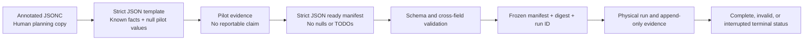

# EXPERIMENTAL PROTOCOL

## Purpose And Evidence Standard

This document defines how the project moves from an implementation scaffold to a credible result. It does not prescribe an attractive demonstration; it prescribes the conditions under which a claim is allowed. A graph, MQTT message, or successful command transmission is not sufficient evidence by itself. Every reportable result must connect a frozen input manifest to a known physical setup, raw trace data, reconciled counters, analysis code or method, and one explicit terminal status.

The primary experiment investigates whether a cross-layer model improves prediction of deadline-sensitive Thread traffic relative to a network-only model, and whether the system declines to actuate when that model is not currently trustworthy. The system can only be called a closed-loop digital twin after the model-to-policy-to-physical-result return path has been verified. Before that point, use the more precise term **digital shadow**.

This distinction follows current network-digital-twin architectural research: two-way data/control synchronization and a full feedback cycle distinguish a digital twin from a digital model or shadow. The goal here is not to claim a universal definition, but to make the chosen behavior observable and falsifiable in a student-scale system. [IRTF Network Digital Twin Architecture](https://datatracker.ietf.org/doc/draft-irtf-nmrg-network-digital-twin-arch/)

## Research Questions

### Primary Question: Does Cross-Layer State Improve Held-Out Prediction?

The principal investigation evaluates whether incorporating internal node and MAC-layer telemetry improves prediction accuracy over network-only observables. To prevent confounding model architecture with feature availability, both candidate models share the exact same model family ($f_\theta$), loss formulation, calibration block, and held-out evaluation horizons:

1. **Naive Baseline ($M_{\text{naive}}$):** A historical moving-average predictor that establishes the non-parametric statistical floor.
2. **Network-Only Model ($M_{\text{network}}$):** $M_{\text{network}} = f_\theta(X_{\text{network}})$, utilizing network-visible features including packet delivery outcome, link RSSI, and offered traffic load.
3. **Cross-Layer Model ($M_{\text{cross}}$):** $M_{\text{cross}} = f_\theta(X_{\text{network}}, X_{\text{cross}})$, utilizing network features plus internal device telemetry: OpenThread MAC counters (`mTxRetry`, `mTxErrCca`, `mTxDirectMaxRetryExpiry`), endpoint EDF queue occupancy and preemptive expiry counts, parent link quality (`mLinkQualityIn`/`mLinkQualityOut`), and FreeRTOS execution traces.

The statistical comparison evaluates the relative reduction in held-out P95 prediction error:

$$\Delta = \frac{\text{Error}(M_{\text{network}}) - \text{Error}(M_{\text{cross}})}{\text{Error}(M_{\text{network}})}$$

- **Null Hypothesis ($H_0$):** Cross-layer features do not improve held-out prediction accuracy beyond the predeclared engineering relevance threshold of 15% ($H_0: \Delta \le 0.15$).
- **Alternative Hypothesis ($H_1$):** Cross-layer features achieve a meaningful reduction in held-out relative P95 error exceeding the threshold ($H_1: \Delta > 0.15$).

Failing to reject $H_0$ constitutes an admissible negative finding, demonstrating that cross-layer telemetry does not justify additional instrumentation overhead under the tested regime.

**Experimental Units and Uncertainty Estimation:**
Independent physical **runs** (with randomized treatment order and distinct boot cycles) serve as the primary experimental unit for between-condition comparisons. For time-series uncertainty estimation within a continuous run, consecutive observation windows exhibit temporal autocorrelation; standard IID resampling is invalid. Scored horizons are resampled using a **block bootstrap** (1,000 resamples), with block length determined by the empirical autocorrelation decay of prediction residuals, to construct 95% confidence intervals on P95 error and interval coverage.

### Primary Question: Does Fidelity-Gated Control Fail Safely?

The second primary question asks whether a valid, finite policy is withdrawn when the evidence supporting it becomes stale or invalid. The initial actuator surface is deliberately narrow: reduce bulk traffic rate or burst behavior while preserving a protected critical stream. The stale-observation scenario pauses only the gateway-to-host observation publication path; endpoint traffic and Thread routing continue. The expected result is a recorded gate abstention and edge-local fallback, not a service outage.

The safety outcome is not a favorable performance number. **Zero invalid policy applications** is the acceptance criterion for the tested negative cases: stale observation, expired command, wrong run ID, duplicate or older epoch, unauthenticated/corrupted payload, endpoint restart, and local-limit violation. Beyond a binary pass/fail, the gate's behavior curve is characterized over time (observation age vs. gate state, hysteresis recovery windows, and Kalman covariance $P[2][2]$ bounds).

### Extension: What Does ESP32-S3 SMP Change?

The SMP comparison is an optional extension that becomes valid only after the physical baseline, recorder, and primary safety chain are stable. It pairs normal ESP-IDF SMP builds with `CONFIG_FREERTOS_UNICORE` builds using the same source revision, topology, workload, and measurement protocol. The intended outcome is a measured difference, or an honest lack of one, in critical-service timing, gateway queueing, and task/core behavior. ESP-IDF documents these distinct scheduler modes; the protocol must still control for all non-scheduler variation. [ESP-IDF FreeRTOS SMP Guide](https://docs.espressif.com/projects/esp-idf/en/latest/esp32s3/api-reference/system/freertos_idf.html)

### Extension: What Is The Energy Cost Of Timeliness?

The power-policy experiment compares an always-on endpoint profile with a bounded low-power profile under matched traffic and service acceptance. The primary energy expression is energy per successfully delivered critical item, reported beside critical service rather than in isolation. INA219 values are comparative measurements only unless their calibration, sampling interval, rail boundary, and measurement overhead have been documented. A lower energy number that follows a loss of critical service is not an improvement.

## Experiment Pack And Priority

The eight manifests are not eight mandatory final results. They are a progression from correctness to physical networking, prediction, safety, and optional extensions.

| Manifest | Role In The Program | Minimum Condition Before It Becomes Reportable |
|---|---|---|
| [local-rtos-baseline.json](experiments/local-rtos-baseline.json) | Endpoint timer, queue, expiry, and accounting without Thread | Every released item is reconciled through a local terminal outcome |
| [baseline.json](experiments/baseline.json) | Stable physical Thread baseline without host model or remote actuation | Actual topology, role, placement, and repeated trace block are archived |
| [load-step.json](experiments/load-step.json) | Held-out prediction comparison | Calibration and held-out blocks are separated before model scoring |
| [stale-observation.json](experiments/stale-observation.json) | Gate abstention and local fallback | One finite action exists and stale-observation fallback is captured end to end |
| [restart-replay.json](experiments/restart-replay.json) | Command freshness and restart safety | Old, expired, wrong-run, and replay attempts are recorded as rejections |
| [smp-comparison.json](experiments/smp-comparison.json) | S3 scheduler comparison | Matched SMP/unicore builds and paired physical runs exist |
| [power-policy.json](experiments/power-policy.json) | Comparative energy/service trade-off | Power measurement boundary and sampler overhead control are documented |
| [topology-shift.json](experiments/topology-shift.json) | Model/fidelity response to a controlled placement change | Before/after positions and actual Thread topology are recorded |

The required core sequence is local RTOS baseline, stable Thread baseline, held-out load-step prediction, stale-observation fallback, and restart/replay safety. SMP, power, and topology-shift results are valuable only when they do not endanger the primary evidence chain within the available time window.

## Manifest Lifecycle

The JSON schema deliberately distinguishes preparation from execution. A template can contain `null` values and detailed `_todo` entries. A ready manifest cannot. The host must reject a template even if its title and question look complete.

### Why There Are Two Manifest Forms

Strict JSON has no comment syntax. The files in `experiments/` therefore remain valid JSON and can be checked against [schemas/experiment.schema.json](schemas/experiment.schema.json). The corresponding files in `experiments/authoring/` use the JSONC extension and contain actual `//` comment lines beside the fields an operator must complete. Their comments and `_todo` prose may be more detailed than the strict templates. They are authoring aids, not runtime inputs; only the validated strict JSON file is authoritative for a physical run.

When a pilot decision is ready to freeze, copy the completed values—not the comments—into the matching strict JSON file. Set `state` to `ready` only after every ready-only field has a concrete value, `_todo` is empty, and the strict file passes schema validation. Keep the original ready bytes unchanged once the host creates a run directory.

### Completing A Template Correctly

Complete a manifest in a deliberate order:

1. Freeze physical identity first: board labels, actual roles, channel, placement description, firmware revision, binary digests, and RCP transport. A later change to any of these begins a new calibration block.
2. Use pilots to choose workload period, payload size, burst, run duration, warm-up, cooldown, and repetitions. Do not choose values from a result you intend to claim.
3. Specify a single planned disturbance—load step, observation pause, restart, or placement shift—and make its time, duration, and target concrete.
4. Select a treatment that is compatible with the experiment. Prediction tests have `host_model: true` and `remote_actuation: false`. Baselines use neither. Safety tests enable a narrow candidate action only after profile, authentication, TTL, and fallback paths exist.
5. Name the immutable control profile and calibration identity used by the run. Its resolved digest belongs in the evidence bundle.
6. Predeclare a critical service floor, a negative case, evidence artifacts, and an invalidation rule. These decisions must exist before measurement data are inspected.

## Variables And Controls

The independent variables are intentionally limited. Changing traffic shape, placement, firmware, and scheduler mode in a single run prevents a meaningful conclusion.

| Category | Variables | Rule |
|---|---|---|
| Independent | Model feature set, load step, observation pause, scheduler mode, endpoint profile, physical placement | Change one intended cause per experiment condition |
| Controlled | Board identity, firmware/hash, upstream revision, Thread channel, payload format, topology, placement, power path, run phase durations | Freeze within a calibration or paired block |
| Recorded Context | RSSI/link state, actual Thread role/parent, queue high-water, task/core state, clock uncertainty, ambient/operator notes | Record rather than assume constant |
| Dependent | On-time critical delivery, deadline miss ratio, response/queue delay, prediction error, gate transitions, rejected commands, energy per delivered item | Compute only from reconciled, attributable records |

The physical radio environment cannot be controlled perfectly. Instead, document it. If a person moves a node, a board changes parent, a USB hub browns out, a Wi-Fi backhaul reconnects, or a configuration value changes, capture that fact. The event either becomes a predeclared scenario or invalidates the comparison; it does not disappear into “noise.”

## Measurement Definitions

All metrics refer to unique logical items identified by the tuple `run_id, node_id, boot_id, sequence`. Retransmissions are not new logical items. Work-item trace records retain release, deadline, and event timestamps in one local monotonic domain so timing is derived from explicit evidence rather than reconstructed from aggregate counters.

| Measure | Definition | Validity Condition |
|---|---|---|
| Critical on-time delivery ratio | Number of critical items acknowledged before their deadline divided by critical items released in the measured window | Releases and terminal outcomes reconcile; the deadline clock/uncertainty rule is recorded |
| Deadline miss ratio | Number of released items that become late, expire, or finish after deadline divided by released items | The policy for expiry versus late acknowledgement is declared before the run |
| Queue delay | Time from queue admission to removal for transmission or terminal expiry | Local timestamp scope and clock source are documented |
| Queue high-water | Largest observed bounded queue occupancy during the run | Queue capacity and trace-drop count are archived |
| Prediction error | Difference between pre-event prediction and observed metric on the same horizon | Held-out horizon was not used to tune model parameters |
| Relative P95 prediction error | P95 of absolute relative prediction error over valid scored horizons | Near-zero denominators are handled by a predeclared rule |
| Prediction-interval coverage | Fraction of observations inside the model’s declared interval | Interval construction is versioned before scoring |
| Observation age | Host monotonic time minus time of newest accepted physical observation | Time mapping and uncertainty are available |
| Fallback latency | Time from a declared stale/invalid condition to the local fallback event | Trigger and fallback clocks are traceable or uncertainty-qualified |
| Energy per delivered critical item | Measured energy over the stated rail boundary divided by on-time delivered critical items | Identical service floor and calibrated measurement boundary apply to both conditions |

Reconciliation is intentionally two-stage. First, a sorted raw-trace audit must verify each full logical identity has exactly one release and at most one terminal outcome, with no terminal lacking a release and no unresolved item hidden at the boundary. Second, aggregate reconciliation must balance releases, terminal outcomes, and declared in-flight work per class. A run must pass both: equal totals alone can conceal a duplicated terminal for one item and a missing terminal for another.

Do not report one-way latency without clock uncertainty beside it. Do not report a percentage unless both per-item and aggregate reconciliation pass. Do not report an energy improvement without showing the companion service result.

## Calibration, Held-Out Data, And Model Comparison

The project compares models rather than merely training one. A calibration block contains a stable baseline and designated pilot/load conditions used to fit parameters and choose the profile’s model-related limits. A held-out block contains a condition whose raw traces are never used to tune those parameters, select features, or decide thresholds. The `load-step.json` manifest is designed for this purpose.

For every scored horizon, retain the model revision, feature-set label, prediction issuance time, prediction horizon, predicted interval, source evidence bundle, and observed outcome. Score the network-only and cross-layer model on the exact same horizons. If the feature set or code changes, start a new model revision and do not merge scores across revisions as though they were one treatment.

The fidelity gate is evaluated on completed prior horizons. It must never look at the future observed outcome of the policy it is deciding to issue. A model that is frequently “trusted” but wrong is not a successful controller; a gate that abstains frequently may be correct if it is doing so for documented data-quality reasons.

## Execution Procedure

### Before The First Reportable Run

1. Label every board physically and logically. Record the gateway, RCP, router-capable endpoint, and low-power endpoint identities.
2. Build and archive the firmware, upstream dependency references, build configuration, and binary digests. Ensure the RCP and border router attach repeatedly through power cycles.
3. Survey and photograph the physical placement. Record channel, orientation, power connections, UART wiring, and expected backhaul path.
4. Run a local RTOS accounting pilot with Thread disabled. Verify that release, queue, expiry, and terminal records reconcile.
5. Bring up the stable Thread topology without host model or remote actuation. Record actual roles, parent relationships, reachability, and normal observation cadence.
6. Test the recorder with an intentionally interrupted non-reportable run. Confirm it records an interrupted terminal status rather than silently appearing complete.

### For Each Physical Run

1. Validate the strict ready JSON file and preserve its exact bytes before booting the measurement phase.
2. Resolve the selected control profile, record its ID, calibration ID, and digest, then reject the run if it does not match the manifest.
3. Create a new run directory. It must not reuse an existing directory or overwrite an older run.
4. Confirm board identity, firmware identity, Thread attachment, actual topology, time-sync health, and baseline counter state.
5. Start warm-up. Record warm-up data but keep it outside the primary measurement calculation.
6. Start the measurement window, store the monotonic start boundary, and capture every observation before updating the model.
7. Introduce only the manifest’s one declared scenario at the frozen time. Record operator action and observed device acknowledgement.
8. For shadow-model runs, predict and score without enabling remote actuation.
9. For safety runs, allow only the named finite candidate action and retain every acceptance, rejection, expiry, and fallback trace.
10. End measurement and cooldown cleanly. Request final counters from each device before finalizing evidence.
11. Reconcile counters by traffic class. Mark the run invalid if reconciliation fails or a planned control condition was not reached.
12. Write one terminal status and operator notes. A run may be complete, invalid, or interrupted; it is never silently discarded.

### Paired And Repeated Runs

Use at least three non-reportable pilot repetitions to understand stable variance and choose the measurement duration. The final repetition count must be selected before inspecting the treatment’s final outcome. For paired comparisons such as SMP versus unicore or always-on versus low-power, alternate or randomize condition order within one stable physical block and reboot only the board whose documented build changes. Preserve the pair ID and exclusion rule.

There is no universal repetition count that magically fixes a noisy wireless experiment. The defensible approach is to state the planned number, report every valid/invalid/interrupted run, summarize distribution rather than a single best value, and explain any exclusion with raw evidence.

## Safety Cases

### Stale Observation Fallback

Use an application-level publication gate at the gateway or host adapter to pause observations after normal gated-control operation begins. Do not jam RF, disconnect endpoints, or perturb Thread routing. The pause duration must exceed the control profile’s recorded maximum observation age with a margin that lets recovery be seen. The expected evidence sequence is: newest accepted observation, stale condition, host gate abstention, finite command expiry or local fallback, endpoint acknowledgement, and post-fallback counter/service state.

### Restart And Replay

First prove one normal command acceptance with valid ChaCha20-Poly1305 authentication (RFC 8439) using the active pre-shared key. Then restart only the selected endpoint and record a new boot identity. Send old-epoch, expired, wrong-run, corrupted-tag, and replayed commands through the normal gateway path; never bypass authentication or call private apply functions. Every attempt must have a logged status code and reason (`CLDT_ERR_AUTHENTICATION`, `CLDT_ERR_EXPIRED`, `CLDT_ERR_OUT_OF_ORDER`, `CLDT_ERR_WRONG_RUN`). Zero invalid policy applications is the acceptance criterion for the tested replay, authentication, epoch freshness, and state-validation cases.

### Topology Shift

Move only the endpoint named in the manifest between two pre-measured, photographed positions. Keep other boards, the channel, and workload fixed. Record actual role, parent, partition, and link state before and after the shift. A correct result can be either documented retained fidelity or gate abstention. Selecting the favorable interpretation after seeing the graph is prohibited.

## Acceptance, Exclusion, And Reporting Rules

| Decision | Rule |
|---|---|
| Complete result | Ready manifest, topology evidence, required artifacts, per-item lifecycle audit, and aggregate counter reconciliation are present; the planned scenario occurred |
| Invalid result | Missing required evidence, counter mismatch, wrong firmware/profile/topology, unexpected second disturbance, or failed command-audit completeness |
| Interrupted result | Operator, power, or external condition ends the run before terminal collection; preserve partial raw evidence and reason |
| Excluded observation | Only a predeclared, documented reason may exclude it; retain it in raw data and report the count |
| Model comparison | Score naive, network-only, and cross-layer models on identical held-out horizons; do not compare separately chosen best runs |
| Energy comparison | Enforce the same critical-service acceptance condition for every compared profile |

The final report must include negative results, failed safety checks, and invalid runs. The technical reason for an invalid run is often more educational and more credible than an unexplained absence from a chart.

## Evidence Bundle And Automated Reproduction

Each run directory contains an immutable evidence package:

- the original ready manifest and its SHA-256 digest;
- `versions.json` recording source revision, ESP-IDF/upstream revision, build configuration, binary hashes, control-profile/calibration identity, and tool versions;
- physical topology/placement record and required photographs;
- raw append-only event stream (`events.csv`) and broker captures;
- device final counters, trace-drop counts, queue high-water marks, and clock-uncertainty data;
- command audit containing proposal, acceptance/rejection reason, epoch, TTL, Poly1305 authentication tags, expiry, and fallback records;
- model revision, prediction horizons, feature-set label, and derived analysis;
- calibration and rail-boundary record for power runs; and
- terminal status plus operator notes.

A standalone reproduction script ([host/analysis/reproduce.py](host/analysis/reproduce.py)) takes a run directory and autonomously executes the two-stage item-level lifecycle audit, fits the naive baseline, network-only, and cross-layer models on the calibration block, scores on the held-out block, calculates 95% bootstrap confidence intervals, and generates the gate characterization curve. A reviewer can reproduce all reported numbers with a single command.

## Six-And-A-Half-Week Execution Plan

The schedule is evidence-first. It assumes the work window from mid-September to 1 November and treats optional features as expendable.

| Period | Gate | Output Required Before Moving Forward |
|---|---|---|
| Week 1 | Local correctness | Protocol/metric skeleton implemented enough for fixed tests; local endpoint accounting manifest completed from pilots |
| Week 2 | Physical Thread baseline | RCP and border router attach; two endpoints communicate; topology and versions are archived |
| Week 3 | Observation integrity | Project frames, gateway bridge, raw recorder, and reconciliation function through repeated baseline runs |
| Week 4 | Shadow-model validity | Network-only and cross-layer models score on a predeclared held-out load step |
| Week 5 | Safety closure | Fidelity gate, finite bulk action, stale-observation fallback, and restart/replay rejection produce complete audit traces |
| Week 6 | Optional depth | SMP/unicore or calibrated power extension only if primary gates remain stable |
| Final days | Freeze and communicate | Repeat core runs, verify artifacts, write limitations, and prepare a short live explanation that never overclaims |

If Week 3 is late, remove optional work immediately. A high-quality baseline plus a complete stale-fallback experiment is more valuable than a dashboard, sensor integration, and half-finished power claim.

## Limits Of Interpretation

This protocol measures a small, specific 802.15.4 Thread topology, not the performance of Thread in general. It does not establish a production security posture, an O-RAN implementation, Wi-Fi 7 behavior, cellular performance, or a universal digital-twin architecture. It may show that a particular cross-layer feature set improves, matches, or fails to improve prediction under the documented conditions. Each result must remain scoped to the actual hardware, radio environment, workload, firmware, model revision, and repetition set recorded in its evidence.

That limitation is not a weakness. BMW Lab’s public research spans much larger wireless and digital-twin environments; a well-executed small system demonstrates the transferable discipline of data collection, synchronized modeling, controlled experimentation, and evidence-backed control without pretending that a low-cost bench is a cellular lab. The linked TEEP page is the 2026 call and is used only as historical evidence of topic alignment; later calls may differ. [BMW Lab Research](https://sites.google.com/view/bmw-lab/from-prof-ray-website/research) [2026 TEEP Program Listing](https://teep.studyintaiwan.org/program/2109)

## References

- [ITU-T Y.3090: Digital Twin Network Requirements And Architecture](https://www.itu.int/rec/T-REC-Y.3090/en)
- [IRTF Network Digital Twin Architecture Draft](https://datatracker.ietf.org/doc/draft-irtf-nmrg-network-digital-twin-arch/)
- [ESP-IDF Thread Guide](https://docs.espressif.com/projects/esp-idf/en/latest/esp32s3/api-reference/network/esp_openthread.html)
- [ESP-IDF FreeRTOS SMP Guide](https://docs.espressif.com/projects/esp-idf/en/latest/esp32s3/api-reference/system/freertos_idf.html)
