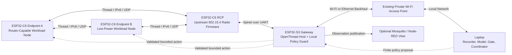
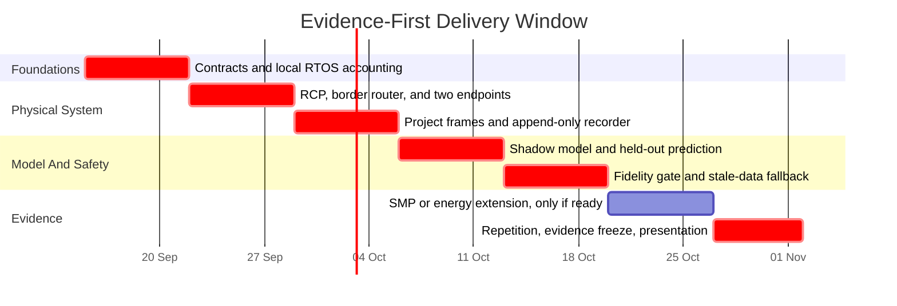

# FIDELITY-GATED CROSS-LAYER DIGITAL TWIN FOR THREAD IOT

This repository is the implementation scaffold for a low-cost, hardware-in-the-loop study of deadline-aware IoT traffic. Its physical system is a small Thread mesh built from ESP32 boards; its host system records evidence, estimates a model, scores the model against reality, and may propose a strictly bounded traffic policy. A proposal is applied only when the host-side fidelity gate, the gateway’s local guard, and endpoint-side validation all agree that it is fresh, attributable, and within local limits.

The central question is deliberately narrow:

> Under what measured conditions is a low-cost network model accurate enough to influence a real Thread IoT system, and how does the system safely abstain when that confidence is no longer justified?

The repository is intentionally not a finished product. It contains contracts, build structure, experiment templates, and detailed implementation boundaries. Project-owned C files are skeletal: they either return `CLDT_ERR_NOT_IMPLEMENTED` or perform bootstrap-only work. No latency, energy, reliability, digital-twin, or SMP result is claimed yet. The future value of this project comes from implementing those boundaries, running the protocol honestly, and publishing the evidence—including failures.

## What Is In The Repository Today

The current repository is an implementation-ready research scaffold. It defines executable contracts, schemas, and build structures rather than claiming completed physical digital-twin operation.

| Area | Present Now | Not Yet Claimed |
|---|---|---|
| Common contracts | C headers and initial scaffolds for frames, timestamps, trace records, metrics, statuses, ChaCha20-Poly1305 auth (`cldt_auth.h`), CRC-32C (`cldt_crc32c.h`), and control profiles | A validated production protocol implementation |
| Host application | Coordinator, Kalman filter state estimator (`kalman.h`), twin model, fidelity gate, policy generator, broker adapter, recorder, manifest parser, and `reproduce.py` reproduction scaffold | A runnable host control loop or a real broker session |
| ESP32 firmware | Separate ESP-IDF projects: S3 gateway (with OpenThread MAC diagnostics `thread_diagnostic.h`) and C6 endpoint (with EDF deadline queue `deadline_queue.h` and INA219 power probe `power_probe.h`) | A flashed Thread mesh, MQTT bridge, BLE provisioning, or policy application |
| Experiments | Eight schema-valid planning manifests, each intentionally incomplete | A run-ready manifest or captured result |
| Verification | CMake layout and test skeletons that return the documented skip code | Passing unit, integration, hardware, or statistical tests |
| Documentation | Scope, design, execution protocol, budget, evidence rules, and implementation order | Evidence that the planned system meets them |

The repository does not vendor ESP-IDF, OpenThread, ESP Thread Border Router, Mosquitto, Node-RED, or any other upstream project. Their versions must be pinned and recorded when the physical implementation begins. That preserves licensing clarity and prevents a copied dependency tree from being mistaken for project-authored work.

## Why Build This Project Now

Network digital twins are valuable only when the relationship between the physical system and the model is observable, testable, and safe to use. ITU-T Recommendation Y.3090 is in force as a requirements-and-architecture reference for digital twin networks. The IRTF Network Management Research Group’s active Network Digital Twin architecture draft distinguishes a model or digital shadow from a system with automatic two-way synchronization and control. It also emphasizes real-time data, high-fidelity modeling, and verification before policy changes are applied. This project turns those broad ideas into a small, falsifiable IoT experiment rather than a dashboard claim. [ITU-T Y.3090](https://www.itu.int/rec/T-REC-Y.3090/en) [IRTF Network Digital Twin Architecture](https://datatracker.ietf.org/doc/draft-irtf-nmrg-network-digital-twin-arch/)

The direction is closely related to current research at NTUST BMW Lab, but it does not imitate capabilities it cannot truthfully reproduce. BMW Lab describes a 2025–2028 Hybrid Wireless Access Network Digital Twin Platform that combines physical Cellular/Wi-Fi/NTN systems, virtual components, data collection, modeling, synchronization, and control. Its public work also spans communication-protocol performance analysis and IoT applications. The official 2026 TEEP listing for the NTUST program names Digital Twin Technologies, data collection, and real-time simulation among its topics. That listing is evidence of thematic alignment, not a promise that a later call will retain the same dates or requirements. The transferable evidence sought here is therefore practical and relevant: disciplined C engineering, network instrumentation, reproducible experiments, model validation, and safe control boundaries. [BMW Lab Research](https://sites.google.com/view/bmw-lab/from-prof-ray-website/research) [BMW Lab Projects](https://sites.google.com/view/bmw-lab/projects) [2026 TEEP Program Listing](https://teep.studyintaiwan.org/program/2109)

The physical testbed operates on an IEEE 802.15.4 Thread mesh. The project investigates bounded cross-layer modeling and safe control boundaries on low-power IoT networks, rather than higher-frequency cellular, Wi-Fi, or PHY-level channel emulation.

## Intended System

The planned hardware topology separates the Thread radio from the application gateway. ESP-IDF documents Thread as an IP-based mesh protocol built on IEEE 802.15.4, supports a UART-connected 802.15.4 Radio Co-Processor (RCP), and provides `ot_br` and `ot_rcp` examples for this architecture. [ESP-IDF Thread Guide](https://docs.espressif.com/projects/esp-idf/en/latest/esp32s3/api-reference/network/esp_openthread.html)



The gateway is an edge safety authority, not a blind forwarding path. The host is allowed to calculate a proposal; the S3 can still reject it because it has a different responsibility: protecting the physical system when the host, broker, clock, or model becomes unavailable. Endpoints validate the command again against their locally compiled limits. An outage should therefore remove optimization, not remove the safe baseline behavior.

### Physical Roles

| Component | Planned Role | Evidence It Must Produce Before It Is Credited |
|---|---|---|
| ESP32-S3 | OpenThread border-router host, Wi-Fi backhaul, trace aggregation, local policy guard, SMP/unicore comparison target | Binary hash, `sdkconfig`, task/core trace, policy decision trace, and backhaul health |
| ESP32-C6 RCP | Dedicated IEEE 802.15.4 radio co-processor using upstream RCP firmware | Exact upstream revision, target, transport configuration, firmware hash, and attachment evidence |
| ESP32-C6 Endpoint A | Router-capable workload node for critical, telemetry, and forwarding-capable scenarios | Thread role/parent evidence, queue events, deadline outcomes, and boot identity |
| ESP32-C6 Endpoint B | Low-power workload node for periodic, burst, and comparative power scenarios | Equivalent traffic evidence plus calibrated power-boundary notes when energy is measured |
| Laptop | Manifest authority, recorder, model, estimator, fidelity gate, analysis, and artifact storage | Frozen input manifest, run ID, source/dependency versions, raw trace, derived analysis, and terminal status |

The SMP comparison is a genuine experiment, not a code-style claim. ESP-IDF uses an SMP-aware FreeRTOS variant on the ESP32-S3 and offers `CONFIG_FREERTOS_UNICORE` to force an S3 application onto Core 0. It also exposes `xTaskCreatePinnedToCore()` for explicit affinity. The paired experiment must keep the radio topology, workload, source revision, and other build inputs constant while collecting per-core and queue evidence. [ESP-IDF FreeRTOS SMP Guide](https://docs.espressif.com/projects/esp-idf/en/latest/esp32s3/api-reference/system/freertos_idf.html)

## What The Finished Project Must Demonstrate

The target is not a polished dashboard. A fully working result must show a defensible chain of evidence:

1. An endpoint can account for each generated item through a terminal outcome before networking is introduced via local EDF queue scheduling.
2. The Thread topology is attached and its actual roles, parent relationships, firmware identities, and placement are recorded.
3. Project frames, counters, timestamps, OpenThread MAC metrics, and policy epochs are recorded in an append-only run directory.
4. A three-way model benchmark is scored on identical held-out horizons: naive moving-average baseline, network-only model ($M_{\text{network}} = f_\theta(X_{\text{network}})$), and cross-layer model ($M_{\text{cross}} = f_\theta(X_{\text{network}}, X_{\text{cross}})$) sharing the same underlying model family.
5. A fidelity gate rejects control when observations are stale, model residuals/covariance exceed calibrated bounds, clock uncertainty is too high, or data leave the calibrated region.
6. A finite policy command is accepted only when its run identity, strictly monotonic epoch, non-expired TTL, ChaCha20-Poly1305 AEAD authentication (RFC 8439), and local limits pass on the gateway and endpoint.
7. The stale-observation path demonstrably returns the system to a local safe policy without relying on the host.

Only after all seven links are evidenced may the repository report a closed-loop, hardware-in-the-loop digital twin. Before then, the honest labels are **physical testbed**, **offline model**, or **live digital shadow**, depending on the achieved data flow.

## Traffic And Safety Scope

The system uses synthetic payloads so that scheduling and network behavior—not uncontrolled sensor variation—remain the primary experimental object. A BME280 may be used as a demonstrator input, but its readings are not required for the research claim.

| Traffic Class | Purpose | Handling Rule |
|---|---|---|
| Control | Policy acknowledgements and health state | Reserve capacity; reject stale data rather than silently replacing current state |
| Critical | Deadline-sensitive event traffic | Expire an item that cannot meet its deadline via EDF admission control; do not let old work crowd out new critical work |
| Telemetry | Periodic state observations | Coalesce an older equivalent sample only when the manifest permits it |
| Bulk | Diagnostics or synthetic background load | Best effort; shed first under pressure and never use it to justify loss of critical service |

All controlled disturbances are application-level and limited to workload timing, burst size, expiry, a deliberately paused observation path, a controlled endpoint restart, or a documented physical placement change. The project must not jam RF, modify a public network, or use unowned infrastructure as a test target.

## Budget And Prerequisites

The baseline purchase ceiling is **Rp 1,550,000** (with an extended contingency reserve up to **Rp 1,750,000**). The complete, costed ceiling is kept in [hardware/BOM.md](hardware/BOM.md), dated 29 August 2026. Its allocation covers four ESP32 boards, powered USB hub, cables, INA219 modules, optional BME280 sensor, wiring, and an 8-channel USB logic analyzer (Saleae clone) for UART Spinel protocol decoding and hardware trace verification.

| Budget Decision | Rationale |
|---|---|
| Four development boards | One S3 gateway plus three matching C6 boards gives a dedicated RCP and two application endpoints without claiming a large mesh |
| Powered USB hub and data cables | Stable power and serial access are part of reproducible embedded work, not accessories to omit from the budget |
| Two INA219 modules | Enables comparative endpoint energy measurements after calibration; it is not a laboratory-grade power instrument |
| USB logic analyzer (8ch) | Hardware verification of Spinel UART framing between RCP and S3, I2C sensor bus transactions, and GPIO task-switch timing |
| GY-BME280 sensor | Provides a realistic demonstrator input but must not block the timing, network, or fidelity milestones |
| Reserve | Absorbs a board failure, connector issue, or price change without forcing an undocumented architecture change |

An existing laptop and an existing private 2.4 GHz Wi-Fi access point are prerequisites, not hidden costs. Before purchasing, recheck the quoted board revision, availability, and price. If matching C6 boards cannot be obtained within the ceiling, stop and revise the architecture, manifests, and claims together; do not silently substitute a different mesh technology.

## Repository Map

| Location | Responsibility |
|---|---|
| [common/](common/) | Portable C contracts: protocol framing (`cldt_protocol.h`), ChaCha20-Poly1305 auth (`cldt_auth.h`), CRC-32C (`cldt_crc32c.h`), clock sync, event traces, metrics, status codes, and control profiles |
| [host/](host/) | Host-side coordinator, manifest conversion, recorder, broker adapter, Kalman filter estimator (`kalman.h`), twin model, fidelity gate, policy interfaces, and reproduction scaffold (`analysis/reproduce.py`) |
| [firmware/gateway/](firmware/gateway/) | ESP-IDF S3 gateway firmware: OpenThread MAC diagnostics (`thread_diagnostic.h`), RCP/Thread bridge, backhaul, provisioning, and edge policy guard |
| [firmware/endpoint/](firmware/endpoint/) | ESP-IDF C6 endpoint firmware: EDF deadline queue (`deadline_queue.h`), workload generator, OpenThread transport, trace, and INA219 power probe (`power_probe.h`) |
| [experiments/](experiments/) | Eight strict JSON planning templates that conform to the repository schema |
| [experiments/authoring/](experiments/authoring/) | Matching JSONC authoring companions with line comments and operator-focused completion guidance |
| [schemas/](schemas/) | JSON Schema for the template-to-ready lifecycle; this is machine-facing and remains strict JSON |
| [tests/](tests/) | Intentionally skipped C test skeletons that define the required verification surface |
| [hardware/BOM.md](hardware/BOM.md) | Itemized cost ceiling, specifications, vendor links, pinout mappings, and power budget |

There are intentionally only three primary public Markdown documents. This README sets scope and presentation; [DESIGN.md](DESIGN.md) defines ownership, data flow, and implementation boundaries; [EXPERIMENTS.md](EXPERIMENTS.md) defines how a future claim becomes admissible evidence. Supporting documents include [CONTRIBUTING.md](CONTRIBUTING.md) and [SECURITY.md](SECURITY.md). Keeping them separate makes it much easier for a reviewer to distinguish intent, engineering design, and experimental proof.

## Quick Start for Reviewers

The native host target requires Git, CMake 3.20 or newer, and a C11 compiler. The following commands configure the host library, host executable, and skeletal test harness:

```bash
cmake -S . -B build -DCLDT_BUILD_TESTS=ON
cmake --build build --parallel
ctest --test-dir build --output-on-failure
```

At the current scaffold stage, a successful build proves only that the declared C interfaces and translation units are consistent on that toolchain. The four test executables intentionally return the registered skip code because their assertions have not been implemented. The `cldt_host` executable also exits with failure after printing a scaffold notice; it is not yet a runnable experiment coordinator. A green build must therefore never be presented as a completed digital-twin result.

Gateway and endpoint firmware are separate ESP-IDF projects. Install and export one pinned ESP-IDF release before using these entry points:

```bash
cd firmware/gateway
idf.py set-target esp32s3
idf.py build
```

```bash
cd firmware/endpoint
idf.py set-target esp32c6
idf.py build
```

These commands describe the intended build boundary; this repository does not yet claim that the firmware targets pass on hardware. The dedicated C6 RCP must be built from the upstream ESP-IDF `openthread/ot_rcp` example and its exact revision and binary digest must be retained with experiment evidence.

## Manifest Workflow

The experiment files use a two-stage contract:

1. A `state: "template"` manifest records the question, known assumptions, and completion work while retaining pilot-dependent values as `null`.
2. A `state: "ready"` manifest has every required experimental field, no remaining `_todo` entries, and passes the stricter branch of [schemas/experiment.schema.json](schemas/experiment.schema.json).
3. The host must accept only a schema-valid `ready` manifest, freeze the original bytes, compute a documented digest, generate a run ID, and create a new evidence directory before opening any network connection.

Strict JSON cannot contain comments. To provide direct, line-by-line authoring guidance without breaking validators, each strict template has a corresponding `.jsonc` file in [experiments/authoring/](experiments/authoring/). Edit the JSONC file while planning; copy only completed values into its strict `.json` counterpart; then validate the strict file before running. Comments and `_todo` prose may be more detailed in the authoring companion and are not required to be byte-identical. The strict `.json` artifact is the sole runtime authority for a physical run.

## Development Sequence

The correct implementation order follows risk and evidence, not visual features:

1. Make the portable contracts executable and write fixed protocol/metric tests.
2. Prove local endpoint timer, queue, expiry, and counter reconciliation with networking disabled.
3. Build the upstream RCP and border-router examples; record their exact revisions and hashes.
4. Attach one endpoint and then two; preserve actual Thread topology evidence rather than assuming roles.
5. Implement project frames, the gateway bridge, and an append-only host recorder.
6. Operate the measured physical system as a digital shadow with no remote actuation.
7. Fit and score network-only and cross-layer models on separated calibration and held-out conditions.
8. Implement the fail-closed fidelity gate and one bounded, expiring bulk-rate action.
9. Verify stale-observation fallback, restart/replay rejection, and finally the optional SMP and power comparisons.

Node-RED, Blynk, dashboards, extra sensors, and visual polish are deliberately late. They are useful for demonstration only after the evidence path, command rejection path, and raw data integrity are working.

## Six-And-A-Half-Week Delivery Plan

The available window runs from mid-September to 1 November. It is feasible only if each period has a hard evidence gate and optional work is cut when a prerequisite slips.



The gantt dates are a planning visualization, not a promise that every optional experiment will be completed. The non-negotiable deliverable is a reproducible primary chain: local accounting, stable physical baseline, held-out shadow-model score, and stale-observation fallback. If time slips, defer the dashboard, topology-shift presentation, power-policy extension, and SMP comparison before weakening counter reconciliation, raw evidence capture, or negative-case testing.

## Completion Standard

The project is ready to present only when a reviewer can clone the repository and understand exactly what was done, what input produced a result, and what the result does **not** prove. At minimum, a final evidence bundle should contain the frozen ready manifest, source and dependency identities, binary hashes, topology/placement record, raw append-only events, final counters, calibration notes, model version, derived analysis, and a terminal status explaining any invalid or interrupted run.

Negative results are valid results. A cross-layer model that does not improve held-out prediction, a policy that cannot preserve critical service, or an energy effect too small for the measurement boundary are all useful findings when the evidence is complete. Suppressing those outcomes would make the project less credible, not more impressive.

## References

- [BMW Lab Research](https://sites.google.com/view/bmw-lab/from-prof-ray-website/research)
- [BMW Lab Projects](https://sites.google.com/view/bmw-lab/projects)
- [BMW Lab TEEP Guidance](https://sites.google.com/view/bmw-lab/teep-intern)
- [2026 TEEP Program Listing](https://teep.studyintaiwan.org/program/2109)
- [ITU-T Y.3090: Digital Twin Network Requirements And Architecture](https://www.itu.int/rec/T-REC-Y.3090/en)
- [IRTF Network Digital Twin Architecture Draft](https://datatracker.ietf.org/doc/draft-irtf-nmrg-network-digital-twin-arch/)
- [ESP-IDF Thread Guide](https://docs.espressif.com/projects/esp-idf/en/latest/esp32s3/api-reference/network/esp_openthread.html)
- [ESP-IDF FreeRTOS SMP Guide](https://docs.espressif.com/projects/esp-idf/en/latest/esp32s3/api-reference/system/freertos_idf.html)
- [ESP Thread Border Router](https://github.com/espressif/esp-thread-br)
- [ns-3 Documentation](https://www.nsnam.org/documentation/)

The IRTF document is an active Internet-Draft rather than an approved Internet Standard. It is cited as current architectural research, not as a compliance claim.

## License

Project-owned code and documentation are released under the [MIT License](LICENSE). Upstream dependencies retain their own licenses and are not relicensed by this repository.
