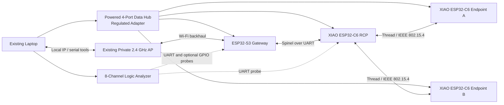

# BILL OF MATERIALS AND PROCUREMENT CONTRACT

> **Status: version-one purchase plan.** This BOM funds only the six-week
> four-board implementation target. Items described in
> [FUTURE_PROJECTION.md](../FUTURE_PROJECTION.md) are not authorized purchases
> and are not included in this ceiling.

## 1. Scope And Financial Boundary

The physical architecture contains one ESP32-S3 gateway, one dedicated
ESP32-C6 OpenThread RCP, and two matching ESP32-C6 application endpoints. The
purchase plan favors stable power, known data cables, recoverable wiring, and a
protected replacement reserve over optional sensors.

- **Hard spending ceiling:** **Rp 1,750,000**
- **Planned committed purchases before contingency:** **Rp 1,575,000**
- **Protected contingency:** **Rp 175,000**
- **Price-check date:** 30 August 2026

All amounts below are allocations, not permanent vendor quotations. Recheck
stock, exact board revision, included accessories, shipping, and final checkout
price before purchase.

## 2. Version-One Allocation

| Item | System Role | Qty | Maximum Allocation | Procurement Evidence And Rule |
|---|---|---:|---:|---|
| **ESP32-S3 N16R8 development board** | OpenThread host, Wi-Fi backhaul, gateway runtime, local policy guard | 1 | Rp 140,000 | Current planning source: [Jogja Robotika](https://jogjarobotika.com/produk/6151/esp32-s3-n16r8-devkitc-1-type-c-esp32-s3-wroom-16mb-flash-8mb-psram-esp32s3-dev-board-module). Record exact module and board revision. |
| **Seeed Studio XIAO ESP32-C6** | One RCP and two Thread workload endpoints | 3 | Rp 610,000 | Secure three matching units before purchasing optional equipment. Recheck [Digiware](https://digiwarestore.com/en/microcontroller-dev-tools/seeed-studio-xiao-esp32c6-with-dual-32-bit-risc-v-processors-support-24ghz-wifi-6-ble-50-zigbee-and-thread-442532.html) and [EasyWare](https://www.easyware.co.id/product/seeed-studio-xiao-esp32-c6-development-board-wifi-6-bluetooth-ble-zigbee-thread-2-4ghz-risc-v-type-c-module/); do not mix an undocumented substitute into the experiment. |
| **Powered four-port USB hub with included regulated adapter** | Stable simultaneous power and host data for all four boards | 1 | Rp 370,000 | For the H4928-U3-V1, verify the included **12 V/2 A** adapter, local plug, four data ports, and no host backfeed; ORICO specifies that input for this model. Any substitute needs an equally documented aggregate power budget, not merely a charging-port claim. Example local listing: [ORICO H4928-U3 with adapter](https://www.blibli.com/p/orico-h4928-u3-4-port-usb-3-0-hub-with-power-adapter/ps--ORI-70037-00400); [ORICO specification](https://www.orico.cc/index/product/detail/965.html). |
| **Known data-capable USB-C cables** | Flashing, serial monitoring, and board power | 4 | Rp 100,000 | Test every cable for data before the first firmware session; label it after verification. |
| **Breadboards, headers, jumpers, isolation parts, and passives** | UART crossover, reset/boot access, bypassing, safe power fixtures | 1 lot | Rp 125,000 | Include headers appropriate for XIAO boards, short UART jumpers, 100 nF and 100 µF bypass capacitors, and any required Schottky/isolation parts. |
| **8-channel 24 MHz USB logic analyzer** | Spinel UART decoding and coarse GPIO/I2C integration evidence | 1 | Rp 105,000 | Use a sigrok-compatible unit where possible. It is an integration instrument, not a nanosecond timing reference. |
| **Consolidated domestic shipping** | Tracked delivery from the minimum practical number of stores | 1 lot | Rp 125,000 | Confirm stock before splitting orders. Preserve invoices with procurement notes. |
| **Protected replacement and price contingency** | Board/cable failure, connector problem, or verified price movement | Reserve | Rp 175,000 | Do not pre-spend this allocation on sensors or visual accessories. |
| **TOTAL HARD CEILING** |  |  | **Rp 1,750,000** | Stop and revise the architecture if the required set cannot be obtained within this ceiling. |

The logic analyzer is strongly recommended but remains the first removable item
if a required board or safe powered hub would otherwise exceed the ceiling. The
contingency is not a discretionary feature budget.

## 3. Explicitly Deferred Purchases

The following items are excluded from the version-one checkout:

| Item | Current Decision | Reason |
|---|---|---|
| INA219 modules | **Do not purchase for the primary study** | With a 0.1 ohm shunt, the 10 microvolt raw shunt-voltage step corresponds to 100 microamps. That is inadequate evidence for a claimed 180 microamp sleep current. [TI INA219 datasheet](https://www.ti.com/lit/ds/symlink/ina219.pdf) |
| INA226 modules | **Future optional pilot** | Better resolution supports coarse energy and average-power work, but not microsecond RF transients or an automatic deep-sleep claim. Adoption requires a new measurement-boundary plan. |
| BME280 module | **Deferred** | Synthetic workloads already isolate the timing/network question; an environmental payload adds demonstration value but no primary evidence. |
| nRF52840 sniffer | **Future projection** | Independent capture is valuable only after the primary recorder is complete and its clock/loss/key-handling limitations have their own protocol. |
| ESP32-C3 coexistence node | **Not required** | A controlled laptop-to-AP workload can pilot the same question before another firmware platform is justified. |
| Fourth C6 topology node | **Future projection** | The existing placement-shift experiment must first show that another physical topology regime is scientifically necessary. |

## 4. Physical And USB Topology

The four hub ports are fully allocated to the four development boards. The logic
analyzer connects directly to a separate laptop USB port.

During ordinary operation the RCP may not need an open serial console, but it
still receives known, documented power. Do not assume that the S3 board safely
powers the RCP through signal wiring.

## 5. S3-To-C6 RCP Wiring

The first implementation uses the upstream ESP-IDF `ot_br` and `ot_rcp`
examples over UART at the configuration recorded with the build. UART remains
the bring-up interface because it is easy to probe and recover; SPI is future
work unless measurements show that UART is the limiting factor.

| Signal | ESP32-S3 Gateway | XIAO ESP32-C6 RCP | Rule |
|---|---|---|---|
| Gateway TX to RCP RX | `GPIO17` | `D7` / `GPIO17` / RX | Cross TX to RX; record the configured UART instance and baud. |
| Gateway RX from RCP TX | `GPIO18` | `D6` / `GPIO16` / TX | Cross RX to TX; do not use the previous reversed D6/D7 mapping. |
| Signal reference | `GND` | `GND` | Bond grounds before connecting UART signals. |
| Optional reset control | Chosen free S3 GPIO | C6 `EN` | Leave unconnected until the electrical behavior is verified. |
| Optional boot control | Chosen free S3 GPIO | C6 boot input / `GPIO9` | Leave unconnected until the flashing/reset procedure is documented. |

The official XIAO C6 pin map defines `D6/TX = GPIO16`, `D7/RX = GPIO17`,
`D4/SDA = GPIO22`, and `D5/SCL = GPIO23`. [Seeed XIAO ESP32-C6 pin map](https://wiki.seeedstudio.com/xiao_esp32c6_getting_started/#pin-map)

## 6. Power And Instrumentation Rules

1. Use one defined power source per board. Never combine ordinary USB VBUS with
   an external header rail unless the board-specific isolation arrangement has
   been designed and verified.
2. Verify the powered hub and adapter under simultaneous board activity before
   reportable runs. Record brownouts or reconnects as invalidating events, not
   unexplained noise.
3. Keep UART wiring short, share ground, and capture both directions during the
   initial Spinel bring-up.
4. A 24 MHz analyzer samples every approximately 41.7 ns. That is useful for a
   460,800-baud UART bit period of approximately 2.17 microseconds, but one
   sample is not a defensible 42 ns context-switch measurement.
5. The analyzer is not an independent RF observer and cannot establish packet
   delivery by itself.
6. Any future current monitor requires a mutually exclusive power procedure,
   a stated rail boundary, shunt calibration, sampling-overhead accounting, and
   a companion service metric.

## 7. Procurement Gates

- [ ] Confirm three matching XIAO ESP32-C6 units are simultaneously orderable.
- [ ] Confirm the S3 listing is the exact N16R8 revision expected by the build.
- [ ] Confirm the powered hub includes its regulated adapter and four data ports.
- [ ] Confirm laptop capacity for the hub plus analyzer during bring-up.
- [ ] Purchase only the required set; leave Rp 175,000 protected.
- [ ] Test and label all data cables before connecting every board at once.
- [ ] Photograph board labels and wiring after the official pin map is applied.
- [ ] Record invoices, delivered revisions, and substitutions in procurement notes.
- [ ] If any required substitution changes board type or pinout, revise the BOM,
      firmware configuration, manifests, and claim boundary together before use.
