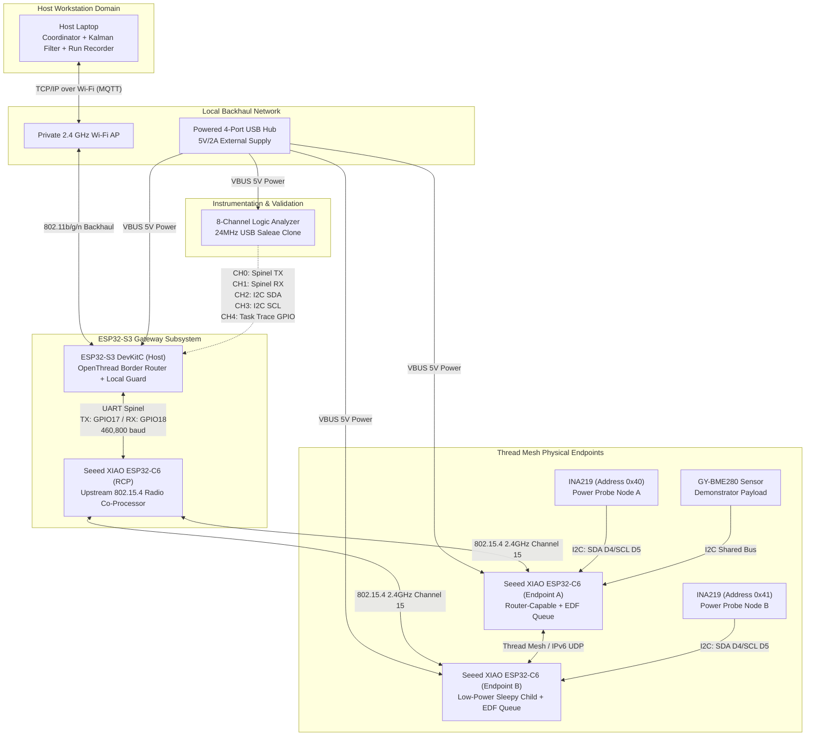
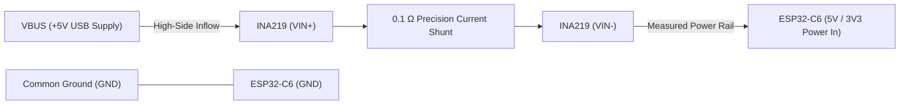

# BILL OF MATERIALS (BOM) & HARDWARE PROCUREMENT SPECIFICATION

## 1. Executive Summary

This document specifies the complete Bill of Materials (BOM), cost ceiling, component procurement sources, and electrical interconnection topology for the **Fidelity-Gated Cross-Layer Digital Twin for Thread IoT** project.

The hardware architecture deliberately isolates the 802.15.4 Radio Co-Processor (RCP) from the OpenThread border router application gateway (ESP32-S3) and deploys two physical application workload endpoints (ESP32-C6). All items are commercially available from local Indonesian distributors.

### Budget Summary & Financial Ceilings
- **Baseline Procurement Cost:** **Rp 1,550,000** (Full hardware kit with demonstrator sensor and logic analyzer)
- **Hard Upper Spending Ceiling:** **Rp 1,750,000** (Extended contingency reserve)
- **Currency & Date Baseline:** Indonesian Rupiah (IDR), verified 29 August 2026

---

## 2. Itemized Bill Of Materials

| Item | System Role | Qty | Unit Price (IDR) | Subtotal (IDR) | Status | Verified Source | Checked Date | Engineering Assumptions & Notes |
|---|---|:---:|:---:|:---:|:---:|---|:---:|---|
| **ESP32-S3 N16R8 DevKitC-1** | Dual-core OpenThread host, Wi-Fi backhaul, trace aggregator, edge policy guard | 1 | 160,000 | 160,000 | Required | [Jogja Robotika](https://jogjarobotika.com/produk/6151/esp32-s3-n16r8-devkitc-1-type-c-esp32-s3-wroom-16mb-flash-8mb-psram-esp32s3-dev-board-module) | 2026-08-29 | 16MB Flash, 8MB Octal PSRAM; WROOM-1 module; Type-C dual USB; select one exact revision and record binary hash |
| **Seeed Studio XIAO ESP32-C6** | 1x Dedicated 802.15.4 RCP, 2x Thread application workload endpoints (Router + Low-Power) | 3 | 160,000 | 480,000 | Required | [Digiware Store](https://digiwarestore.com/id/microcontroller-dev-tools/seeed-studio-xiao-esp32c6-with-dual-32-bit-risc-v-processors-support-24ghz-wifi-6-ble-50-zigbee-and-thread-442532.html) | 2026-08-29 | RISC-V 160MHz; on-board ceramic + external antenna connector; must use identical board revision across all 3 units |
| **Powered 4-Port USB 3.0 Hub** | Stable development power distribution and simultaneous host serial data access | 1 | 160,000 | 160,000 | Required | [Monotaro Indonesia](https://www.monotaro.id/k/store/usb%20hub%204%20port) | 2026-08-29 | Minimum 5V/2A external power supply adapter; prevents voltage dips and brownouts during simultaneous Thread RF transmissions |
| **USB-C High-Speed Data Cables** | Flashing, runtime monitoring, and board power delivery | 4 | 25,000 | 100,000 | Required | Local Electronics Store | 2026-08-29 | 1.0m shielded; verify all 4 data lines are present (D+, D-, VBUS, GND); test with loopback before flashing |
| **INA219 I2C Current/Power Sensors** | High-side current, voltage, and energy profiling on endpoint nodes | 2 | 25,000 | 50,000 | Required | [Easyware Store](https://www.easyware.co.id/product/cjmcu-219-ina219-i2c-bidirectional-current-power-monitor-module-%E2%9C%85/) | 2026-08-29 | $0.1\ \Omega\ 1\%$ current shunt; default I2C address $0\text{x}40$ on Node A, bridge A0 jumper for $0\text{x}41$ on Node B |
| **USB 8-Channel Logic Analyzer** | Hardware verification of Spinel UART framing, I2C bus transactions, and GPIO trace pins | 1 | 85,000 | 85,000 | Required | Local Electronics Store | 2026-08-29 | 24MHz 8-channel USB analyzer (Saleae compatible); pulse width measurement down to 42 ns for FreeRTOS context switch timing |
| **GY-BME280 Sensor Module** | Temperature, humidity, pressure I2C demonstrator payload | 1 | 90,000 | 90,000 | Optional | [Easyware Store](https://www.easyware.co.id/product/gy-bme280-sensor-suhu-kelembaban-tekanan-i2c-spi-3v3-5v/) | 2026-08-29 | Demonstrator only; synthetic workloads remain the primary experimental object |
| **Breadboards, Headers, Jumpers & Passives** | Circuit assembly, UART Spinel bus link, and pull-up resistors | 1 | 150,000 | 150,000 | Required | Local Electronics Store | 2026-08-29 | 2x 830-point solderless breadboards, 65x male-to-male jumpers, 40x male-to-female jumpers, $4.7\ \text{k}\Omega$ I2C pull-ups, $100\ \mu\text{F}$ bypass capacitors |
| **Domestic Shipping Allowance** | Multi-vendor expedited delivery | 1 | 150,000 | 150,000 | Required | Expedited Courier | 2026-08-29 | Consolidated shipping estimation across Jogja Robotika, Digiware, and Easyware |
| **Replacement & Price Contingency** | Hardware buffer against price shifts or board failure | 1 | 125,000 | 125,000 | Reserve | Project Reserve | 2026-08-29 | Hard-cap contingency; unspent funds remain in reserve |
| **SUBTOTAL (PURCHASE CEILING)** | | | | **Rp 1,550,000** | | | | **Reprice and re-verify before checkout** |

---

## 3. Prerequisite Equipment (Zero-Cost Baseline)

| Item | Specification | Role In Experiment |
|---|---|---|
| **Development Workstation (Laptop)** | x86_64 / ARM64, Linux or Windows, Python 3.12+, CMake 3.20+, GCC/Clang | Host coordinator, Kalman filter estimator, append-only run recorder, broker adapter, and `reproduce.py` pipeline |
| **2.4 GHz Wi-Fi Access Point** | Private WPA2-PSK 802.11b/g/n router | Local backhaul network connecting ESP32-S3 gateway to host workstation; no internet uplink required |

---

## 4. Hardware Roles & Node Topology

---

## 5. Electrical Interconnection & Pin Mapping

### 5.1 Gateway: ESP32-S3 to ESP32-C6 RCP (Spinel Protocol)
The ESP32-S3 communicates with the C6 Radio Co-Processor over a dedicated high-speed full-duplex UART bus running the OpenThread Spinel protocol.

| Signal Name | ESP32-S3 Pin | ESP32-C6 RCP Pin | Wire Type | Description |
|---|:---:|:---:|:---:|---|
| **UART TX $\to$ RX** | `GPIO 17` (UART1 TX) | `GPIO 16` / `D7` (UART RX) | Direct jumper | S3 commands to RCP Spinel interface |
| **UART RX $\leftarrow$ TX** | `GPIO 18` (UART1 RX) | `GPIO 17` / `D6` (UART TX) | Direct jumper | RCP status/frame events to S3 |
| **Common Ground** | `GND` | `GND` | Shared bus | Common signal reference plane |
| **Baud Rate** | 460,800 bps | 460,800 bps | N/A | Hardware flow control disabled on prototype |

### 5.2 Endpoint: ESP32-C6 to INA219 Current Sensor (High-Side Sensing)
Each endpoint node routes its power rail through an INA219 current shunt sensor before entering the 3.3V power domain.

| INA219 Pin | ESP32-C6 Pin | Net / Function |
|---|:---:|---|
| `VCC` | `3V3` | Sensor 3.3V Logic Power |
| `GND` | `GND` | Common Ground Reference |
| `SCL` | `GPIO 7` (`D5`) | I2C Clock ($400\ \text{kHz}$ Fast Mode) |
| `SDA` | `GPIO 6` (`D4`) | I2C Data ($400\ \text{kHz}$ Fast Mode) |
| `VIN+` | 5V / USB VBUS Supply | Supply side before shunt resistor |
| `VIN-` | Device VCC Input | Load side after shunt resistor |

### 5.3 I2C Addressing Strategy
- **Node A INA219:** $0\text{x}40$ (`A0` = GND, `A1` = GND)
- **Node B INA219:** $0\text{x}41$ (`A0` = VCC, `A1` = GND)
- **GY-BME280 (Optional):** $0\text{x}76$ (`SDO` = GND) or $0\text{x}77$ (`SDO` = VCC)

---

## 6. Power Budget & Safety Constraints

1. **Simultaneous Power Consumption:**
   - ESP32-S3 (Active Wi-Fi + Processing): ~120 mA (Peak ~350 mA)
   - ESP32-C6 RCP (Active 802.15.4 RX/TX): ~45 mA (Peak ~120 mA)
   - ESP32-C6 Endpoint A (Active Thread Router): ~45 mA (Peak ~120 mA)
   - ESP32-C6 Endpoint B (Sleepy Child): ~180 µA sleep, ~120 mA TX burst
   - **Total Worst-Case Peak Demand:** ~750 mA @ 5V (3.75 W). The powered USB hub must supply $\ge 1.5\ \text{A}$ continuously.
2. **Dual-Supply Hazard Prevention:**
   - Never connect both USB-C programming power and external header power simultaneously to any board.
   - All ground pins across breadboards, sensors, and the logic analyzer must share a single, bonded low-impedance ground plane to avoid ground bounce during RF transmissions.

---

## 7. Procurement Checklist & Verification Protocol

Before placing orders with suppliers:
- [ ] Confirm the ESP32-S3 board variant is the **N16R8** (16MB Flash, 8MB PSRAM). Smaller N8R2/N4 variants cannot comfortably host OpenThread Border Router alongside Wi-Fi and FreeRTOS trace facilities.
- [ ] Ensure all three Seeed XIAO ESP32-C6 boards share the exact same hardware version and antenna type to prevent asymmetric RF link budgets.
- [ ] Verify that the USB-C cables contain physical data lines (test via computer USB enumeration before assembling the testbed).
- [ ] Calibrate both INA219 shunt resistors with a reference digital multimeter prior to recording experimental energy benchmarks.
